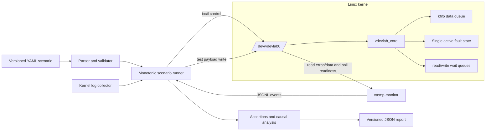

# Architecture

VDevLab is a focused Linux device-client resilience lab. It creates a real
character-device file, injects deterministic failures at its kernel I/O
boundary, runs an ordinary userspace client, and records one causal report.
It does not emulate a particular sensor, bus, board, or electrical interface.

## System view

The scenario runner and the application under test use separate file
descriptors. The runner writes test data and controls fault state; the
application consumes data through the same `read(2)` and `poll(2)` interface it
would use for a simple production character device.

## Components and ownership

| Component | Responsibility | Key boundary |
|---|---|---|
| `include/vdevlab.h` | Stable ioctl numbers and fixed-width fault configuration | Shared kernel/userspace UAPI |
| `kernel/vdevlab_core.c` | Device registration, FIFO, wait queues, fault application, poll bits, reset | Linux `file_operations` |
| `tools/vdevlab-ctl.c` | Human-readable fault set/get/clear/reset commands | ioctl client |
| `src/vdevlab/scenario.py` | Strict schema version 1 parsing and validation | YAML to immutable scenario definition |
| `src/vdevlab/runner.py` | Monotonic scheduling, device dispatch, process lifecycle, output and kernel-log capture | Scenario execution |
| `examples/vtemp_monitor.c` | Reference client with polling, retry, recovery, and disconnect behavior | Application under test |
| `src/vdevlab/analysis.py` | Structured log parsing and recovery metrics | Observations to assertion results |
| `src/vdevlab/report.py` | PASS/FAIL/ERROR/TIMEOUT classification and causal timeline | JSON report schema version 1 |
| `scripts/demo.sh` | Build, run, report verification, and cleanup orchestration | One-command demo Gate |

## Runtime sequence

1. The parser rejects an invalid or unsupported scenario before opening the
   device or starting a process.
2. The runner opens `/dev/vdevlab0`, snapshots the readable kernel log, and
   starts the application in its own process group.
3. A monotonic scheduler dispatches YAML events at absolute deadlines. It does
   not accumulate the duration of earlier event handlers into later deadlines.
4. Fault events use ioctl; write events inject test payload into the FIFO.
5. The reference client waits with `poll(2)`, reads data or errno, and writes
   one JSON object per observable event with a monotonic timestamp.
6. The runner drains stdout and stderr concurrently, records process status,
   captures new kernel warnings, and resets the device on every exit path.
7. Analysis connects the first fault, first error, retries, recovery, process
   result, and cleanup-related observations into a versioned JSON report.

## Kernel data and fault paths

The module exposes one 4,096-byte `kfifo`. FIFO operations are protected by
`vdevlab_fifo_lock`; fault transitions and counted-EIO consumption are
protected independently by `vdevlab_fault_lock`. Read and write wait queues
wake blocked operations when data, capacity, EIO, disconnect, clear, or reset
changes what the operation can observe.

Only one fault is active at a time:

- counted EIO atomically consumes one occurrence per read and then returns to
  normal state;
- delay sleeps at most once per `read(2)` call;
- partial read limits the successful read size without discarding the FIFO
  remainder;
- disconnect returns `ENODEV` to reads and writes and exposes
  `POLLERR | POLLHUP`;
- clear preserves queued data, while reset clears both fault and FIFO state.

The complete contract is in [`fault-model.md`](fault-model.md).

## Determinism and causal ordering

VDevLab makes the controllable parts of the experiment deterministic:

- scenario times are validated integer milliseconds and retain YAML order at
  equal deadlines;
- counted EIO has an exact requested count;
- scenario dispatch and application events use monotonic clocks;
- a scenario event sorts before an application event when both publish the
  same whole-millisecond timestamp;
- every scenario begins and ends with an explicit device reset.

The host scheduler can still introduce ordinary execution jitter. Recovery
latency assertions therefore use explicit upper bounds rather than claiming
cycle-accurate timing.

## Cleanup and failure containment

The runner owns the application process group and attempts graceful
termination before a forced-kill fallback. Normal completion, assertion
failure, dispatch failure, timeout, and Ctrl+C all converge on device reset and
descriptor close. The demo script adds an outer trap that unloads the module
and verifies that the device node is gone.

The runtime Gate is not complete unless all of these are true:

- both scenario reports are schema version 1 and PASS;
- every assertion passes and the kernel log is available with zero warnings;
- no `vtemp-monitor` process remains;
- no active fault, module, or `/dev/vdevlab0` node remains.

## Supported and verified environment

The v0.1 runtime Gate covers Ubuntu 22.04 LTS on x86-64, Linux
`6.8.0-136-generic` and `6.8.0-138-generic`, GCC 12, and Python 3.10. The
Python package declares support for Python 3.10 through 3.12. Other recent
Linux kernels may build, but they are best-effort until the same contract and
demo Gates pass with matching headers.

The runtime requires permission to load an out-of-tree module, access the
device, and read the kernel log. Hosted GitHub Actions validates compilation
and userspace tests but cannot replace the privileged VM runtime Gate.

## Known limitations

- The reference backend is Linux-only and requires matching kernel headers.
- One module instance exposes one device node and one active fault at a time.
- Faults model application-visible I/O behavior, not a physical protocol,
  register map, interrupt controller, DMA engine, or electrical timing.
- Recovery latency has millisecond resolution and includes host scheduling
  jitter; it is not a real-time or performance benchmark.
- The version 1 runner targets a local process and local device path. It does
  not orchestrate distributed targets or hardware-in-the-loop rigs.
- The demo's kernel-warning assertion requires permission to read `dmesg`.
- The module is a test fixture, not hardened production driver code and not a
  security boundary for untrusted tenants.

## Extension boundary

New fault types must define UAPI validation, read/write/poll behavior, wake-up
semantics, reset behavior, contract tests, scenario schema rules, report
evidence, and cleanup checks together. A future backend interface may support
userspace mocks, but it must report capabilities explicitly rather than imply
that a preload or daemon backend exercised the kernel module path.
